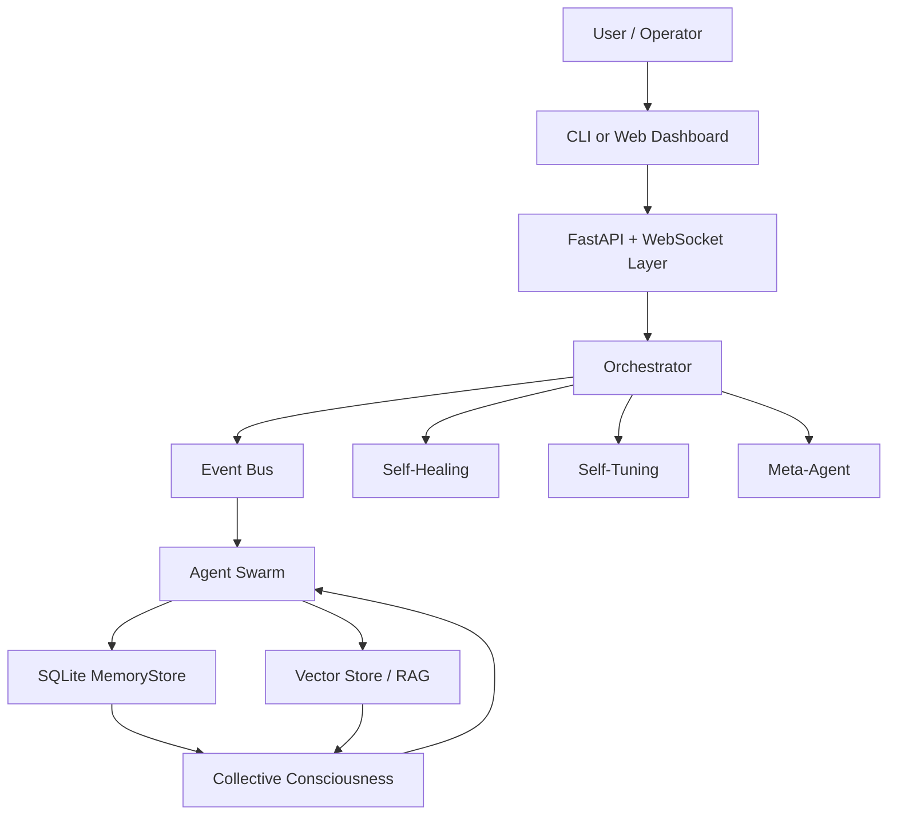
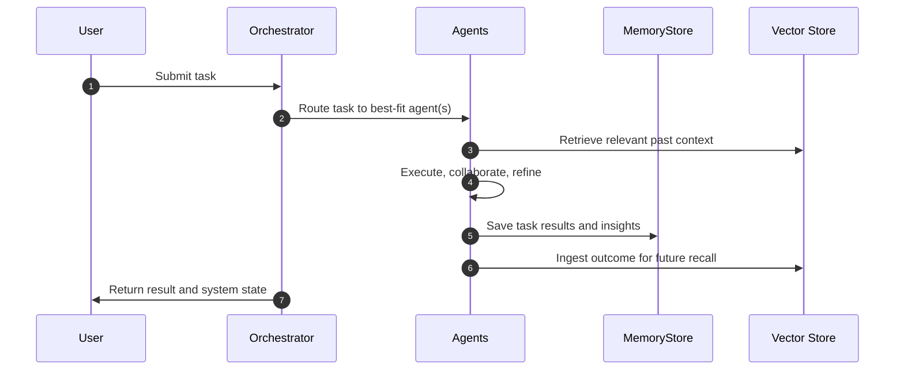
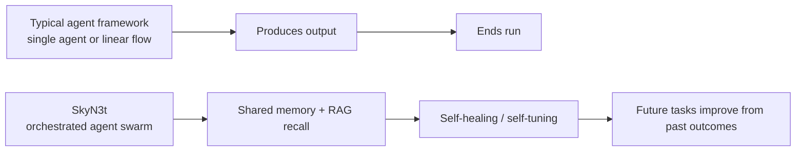
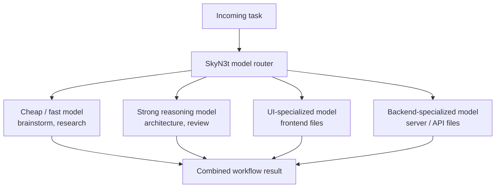

# SkyN3t Orchestrator

**SkyN3t** — *Just A Rather Very Intelligent System*

A multi-agent orchestration system that coordinates multiple AI agents, tracks their work, stores what they learn, and exposes the system through a CLI and a FastAPI web dashboard.

> This README is the short overview. For deeper setup and implementation details, see the linked docs below.

## What it does

SkyN3t manages agent registration, task routing, monitoring, shared memory, and recovery. It supports persistent memory, Retrieval-Augmented Generation (RAG), real-time coordination between agents, and autonomous system improvement through self-healing and self-tuning components.

## What it can be used for

- Running multi-agent workflows and task pipelines
- Coordinating different AI providers and tool-backed agents
- Building systems that remember past tasks and reuse knowledge
- Monitoring agent activity and system state in real time
- Creating autonomous or semi-autonomous assistant platforms
- Supporting research, software tasks, and knowledge retrieval with shared context

## How it works

An orchestrator sends tasks to agents over an event-driven bus. Agents publish outputs and insights back into the system, where they are stored in SQLite and ingested into a vector store for semantic recall. A shared "collective consciousness" layer gives agents access to common working memory and session context, while self-healing, self-tuning, and meta-agent components observe the system and help it adapt over time.

## Different AI models and LLMs

SkyN3t is built to work with **multiple LLM backends**, not just one model. In the repo, it supports or references backends including:

- **Claude** via `claude_cli` and Anthropic
- **OpenAI** via `openai_cli`
- **Copilot CLI**, which can expose GPT and Claude-family models
- **Kimi CLI**
- **OpenRouter**, which can expose models from multiple providers behind one interface

That matters because SkyN3t is designed to **route work to different models based on the job**. Instead of forcing one model to do everything, it can pick cheaper/faster models for lightweight stages and stronger models for review, architecture, or harder reasoning tasks.

Examples from the codebase include:

- **Cheap / fast tiers** for brainstorming, research fan-out, and lighter stages
- **Stronger reasoning tiers** for architecture and review
- **Specialized model choices** for certain file types, such as UI vs backend work
- **Per-agent and per-stage overrides**, so the operator can change backend/model policy without rewriting the system

In short: SkyN3t is not just "an app powered by one LLM." It is an **LLM orchestration layer** that can mix models, providers, and execution styles inside one workflow.

## How it is different from Hermes and similar systems

Compared with **Hermes Agent**, **OpenClaw**, and **Paperclip**, SkyN3t is positioned as a broader orchestration system rather than just a prompt runner or chat wrapper. The repo's mission states that SkyN3t aims to match the common baseline features those systems have, including skills, isolated subagents, Docker-backed execution, persistent memory, and messaging adapters.

Where SkyN3t tries to stand apart is in its emphasis on:

- **Inter-agent coordination** rather than one model working alone
- **Shared memory and collective context** across agents and sessions
- **RAG-backed recall** so past outcomes can influence future tasks
- **Self-healing and self-tuning** so the system can recover and adapt
- **Stricter verification and autonomy** instead of stopping at first-pass output

The mission docs also call out **inter-agent conversation**, **multi-LLM debate**, **brutal verification**, and **real autonomy** as key differentiators. Some of those areas are still actively being completed, so the clearest current difference is the architecture: SkyN3t is designed as a persistent, memory-bearing agent swarm with orchestration, feedback loops, and system-level learning built in.

## Diagrams

### 1. High-level architecture

### 2. Task flow

### 3. SkyN3t vs typical agent frameworks

### 4. Multi-model routing

## Documentation

- [SkyN3t summary](docs/skyn3t-summary.md)
- [Technical flow diagrams](docs/technical_flow_diagram.md)
- [Mission](docs/MISSION.md)
- [Wishlist](docs/WISHLIST.md)
- [Agent guide](AGENTS.md)
