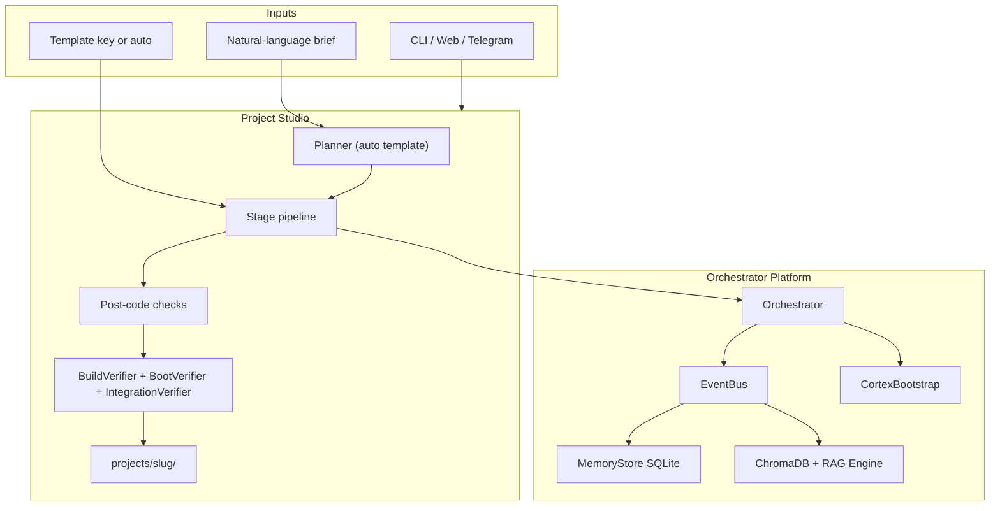
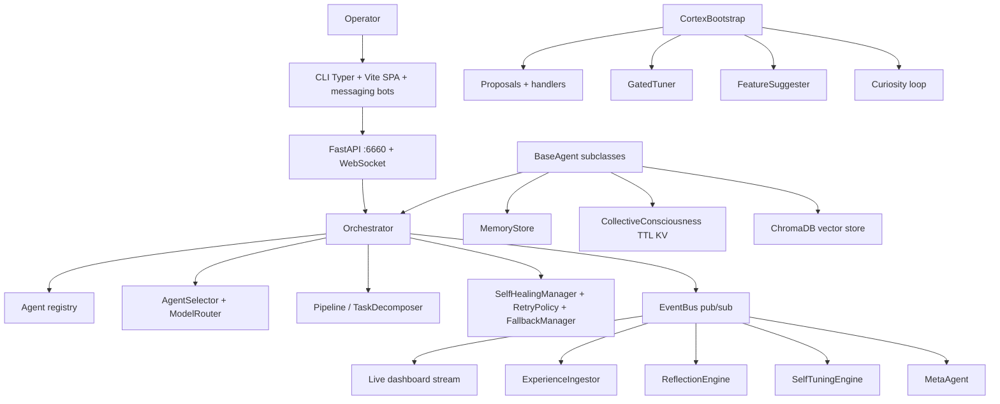
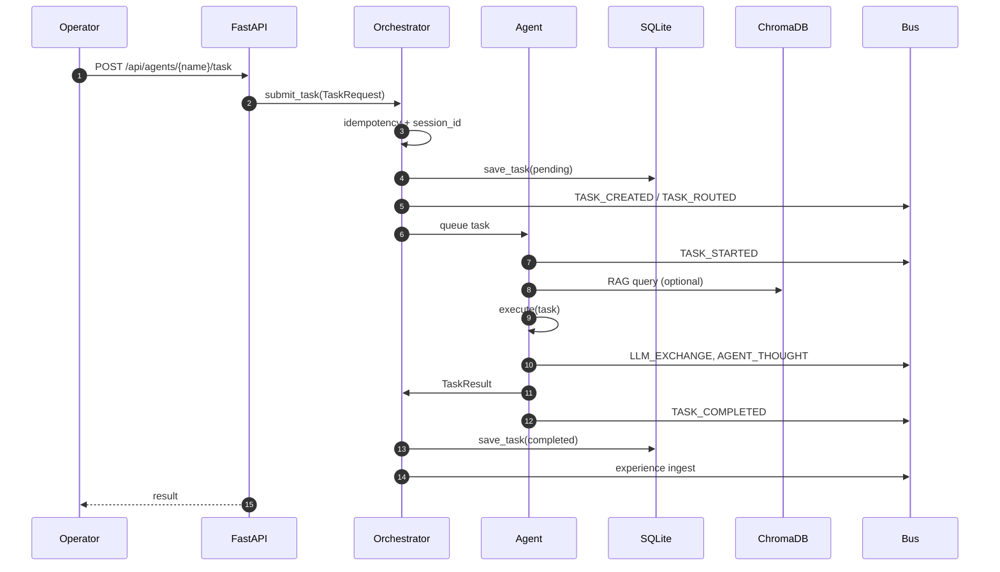
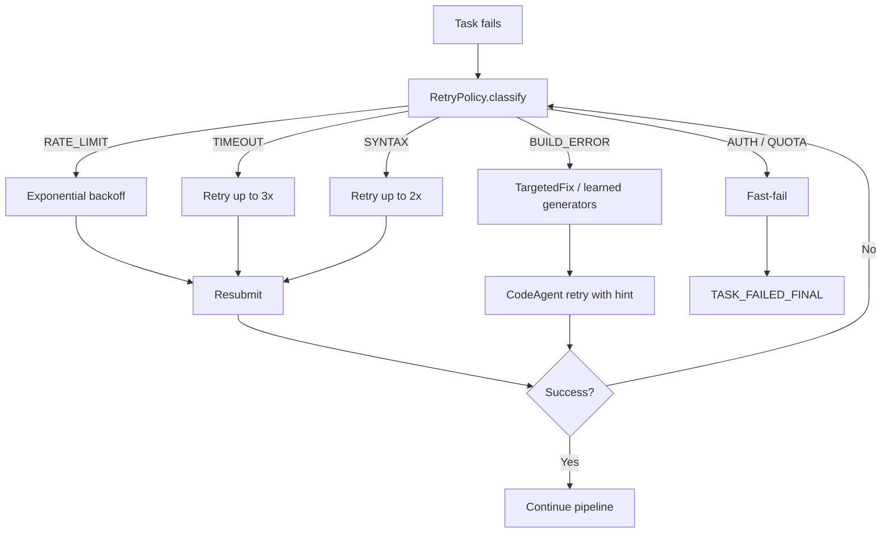
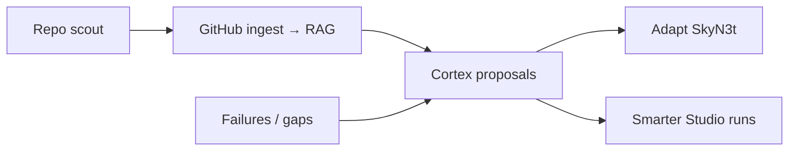

# SkyN3t: System Plan & Rebuild Specification

This document explains what SkyN3t does, how the pieces connect, what works vs what is still maturing, and includes a **copy-paste mega-prompt** for rebuilding the system from scratch with an AI coding agent.

Related docs:

- [README.md](../README.md) — short overview
- [technical_flow_diagram.md](./technical_flow_diagram.md) — detailed Mermaid diagrams
- [MISSION.md](./MISSION.md) — product bar, gaps, build order
- [AGENTS.md](../AGENTS.md) — implementation guide for contributors

---

## What SkyN3t Is

SkyN3t is a **Python async multi-agent orchestrator** whose flagship product is **Project Studio**: you give a natural-language brief (e.g. “build a homelab dashboard with Sonarr, Radarr…”) and it runs a **pipeline of specialist agents** that research, architect, design, code, verify, package, and review—writing artifacts under `projects/`.

It is also a **general orchestration platform**: register agents, route tasks, share memory, RAG recall, self-healing, and a **Cortex** that proposes system improvements.

**Product bar** ([MISSION.md](./MISSION.md)): output should be **runnable software** (`npm install && npm run dev` with real API calls), not markdown theater. Several subsystems work end-to-end; others are **implemented but underfed** (learning signals, strict verification, pipeline-embedded debate).

---

## Two Modes of Operation

| Mode | Entry | What happens |
|------|--------|----------------|
| **Orchestrator** | CLI `start`, REST `/api/agents/{name}/task`, chat | Single tasks routed to registered agents; memory + events + optional RAG |
| **Project Studio** | Web Studio page, Telegram, `StudioRunner.start()` | Multi-stage pipeline → folder under `PROJECTS_DIR` with `manifest.json`, `scaffold/`, `review.md` |



---

## Studio Pipeline (Code Builds)

### Fixed templates

Defined in `skyn3t/studio/templates.py`:

| Key | Purpose |
|-----|---------|
| `app_saas` | Research → architecture → design → code → README → review |
| `marketing` | Research → positioning → campaign → copy → review |
| `business_site` | Research → design → site arch → copy → static site → review |
| `brand_kit` | Research → design → brand voice → review |
| `business_plan` | Research → plan → summary → GTM → review |
| `product_idea` | Research → market scan → architecture → spec → review |
| `frontend_redesign` | Brainstorm → research → architect → design → CodeImprover → review |
| `auto` | Empty stages — **Planner** chooses agents from catalog |

### Injected verification stages

For software builds, `StudioRunner` inserts stages **before** the main `ReviewerAgent`:

```mermaid
flowchart LR
    B["brainstorm"] --> R["research"]
    R --> A["architect"]
    A --> D["designer"]
    D --> C["code_agent"]
    C --> PC["post-code checks"]
    PC --> CV["contract_verifier"]
    CV --> PKG["packaging_agent"]
    PKG --> CR["consistency_reviewer"]
    CR --> RV["reviewer"]
    RV --> BV["build_verifier / boot / integration"]
    BV --> OUT["projects/slug/"]
```



**Post-code** (runner-internal): stack validation, static checks, optional frontend `npm run build` dry-run, fix loops (`TargetedFix`, `CodeImprover`), unresolved-import backfill.

**PackagingAgent** (`skyn3t/agents/packaging_agent.py`): runs after contract, before consistency. Generates runnable packaging by stack family (`web` / `server` / `fullstack`). Disable per-run with `extra={"packaging_enabled": False}`.

**Terminal verifiers** (invoked by runner after reviewer): `BuildVerifierAgent`, `BootVerifierAgent`, `IntegrationContractVerifierAgent`.

### Artifact layout

```
projects/{slug}/
  manifest.json      # status, stages, errors, execution_profile
  scaffold/          # generated source
  review.md          # reviewer output
  Dockerfile         # server/fullstack (when packaging runs)
  docker-compose.yml
  README.md
```

All writes must stay under `PROJECTS_DIR` via `BaseAgent.resolve_artifact_dir()` — never repo CWD.

---

## Core Platform Architecture



### Task execution (orchestrator mode)



### Event bus (selected types)

| Category | Event types |
|----------|-------------|
| Tasks | `TASK_CREATED`, `TASK_ROUTED`, `TASK_STARTED`, `TASK_COMPLETED`, `TASK_FAILED`, `TASK_FAILED_FINAL` |
| Agents | `AGENT_REGISTERED`, `AGENT_THOUGHT`, `AGENT_ERROR`, `AGENT_HEARTBEAT` |
| Pipeline | `PIPELINE_STARTED`, `PIPELINE_STAGE_COMPLETED`, `PIPELINE_STAGE_FAILED` |
| Learning | `KNOWLEDGE_UPDATED`, `COLLECTIVE_INSIGHT`, `CORTEX_DECISION` |
| LLM | `LLM_EXCHANGE` |
| Conversation | `AGENT_CONVERSATION_STARTED`, `AGENT_CONVERSATION_TURN`, `AGENT_CONVERSATION_ENDED` |

Source: `skyn3t/core/events.py`.

### Self-healing loop



---

## Agent Inventory

### Primary Studio agents

| Agent                  | Role                                    |
| ---------------------- | --------------------------------------- |
| `BrainstormAgent`      | Frame mission, constraints              |
| `ResearchAgent`        | Context, comparisons, integration hints |
| `ArchitectAgent`       | Stack, components, `architecture.md`    |
| `DesignerAgent`        | UI/UX, design tokens                    |
| `CodeAgent`            | Scaffold + implementation               |
| `CodeImproverAgent`    | Targeted edits / redesigns              |
| `WriterAgent`          | README, copy, specs                     |
| `MarketerAgent`        | GTM, positioning                        |
| `BusinessAnalystAgent` | Plans, market scan                      |
| `ReviewerAgent`        | Quality gate + blended score            |

### Verification & packaging

| Agent | Role |
|-------|------|
| `ContractVerifierAgent` | Deterministic contract (palette, placeholders) |
| `PackagingAgent` | Runnable-product packaging (Docker, Settings.jsx, etc.) |
| `ConsistencyReviewerAgent` | Cross-file semantic consistency |
| `BuildVerifierAgent` | `npm` / docker build verification |
| `BootVerifierAgent` | Runtime boot smoke |
| `IntegrationContractVerifierAgent` | Frontend ↔ API contract |

### Platform / internal

`ExplorerAgent`, `FileOpsAgent`, `VerifierAgent`, `GitHubExplorerAgent`, `GitHubIngestorAgent`, `DocsIngestorAgent`, `ProjectMemoryAgent`, `SchedulerAgent`, `MetaAgent`, plus integration/webhook agents.

Catalog metadata: `skyn3t/registry/catalog.py`. Lazy resolution for Studio: `skyn3t/studio/registry.py`.

### LLM backends

| Backend | Module |
|---------|--------|
| Claude CLI | `adapters/claude_cli.py` |
| OpenAI CLI | `adapters/openai_cli.py` |
| Copilot CLI | `adapters/copilot_cli.py` |
| Kimi CLI | `adapters/kimi_cli.py` |
| OpenRouter HTTP | settings + fallback paths |
| Anthropic / OpenAI SDK | `adapters/` |

Routing: `skyn3t/core/model_router.py`, `data/model_routing.json`, `data/agent_overrides.json`.

---

## Brain, Learning, and Cortex

| Component | File | Purpose |
|-----------|------|---------|
| MemoryStore | `memory/store.py` | SQLite CRUD: tasks, agents, messages, lessons |
| CollectiveConsciousness | `memory/consciousness.py` | Shared KV, TTL, sessions, insights |
| ExperienceIngestor | `memory/ingestor.py` | Task outcomes → vector store |
| ReflectionEngine | `intelligence/reflection.py` | Post-task analysis → `KNOWLEDGE_UPDATED` |
| SelfTuningEngine | `memory/tuner.py` | Apply reflection to live configs |
| MetaAgent | `memory/meta_agent.py` | Observe trends, hypotheses |
| Skill library | `intelligence/skill_library.py` | Reusable fix patterns |
| Build pattern bias | `cortex/build_pattern_bias.py` | Stack/shape scoreboard |
| CortexBootstrap | `cortex/bootstrap.py` | Autonomy loop lifecycle |

### Cortex components (start order)

| Name | Role |
|------|------|
| `gated_tuner` | Review-gated config tuning |
| `feature_suggester` | Capability gap proposals |
| `curiosity` | Timer-driven exploration |
| `review_watcher` | Studio debug proposals |
| `auto_cleanup` | Periodic housekeeping |

Kill switch: `SKYN3T_CORTEX_DISABLE` (comma list or `*`).

### How the brain loop should work

1. Task execution → MemoryStore + Consciousness
2. ExperienceIngestor → vector store
3. ReflectionEngine → `KNOWLEDGE_UPDATED`
4. SelfTuningEngine → config patches
5. MetaAgent → improvement hypotheses
6. Next task → `collective_context` in prompt

---

## GitHub scout & self-improvement (the idea)

Separate from Project Studio, SkyN3t can **watch the outside world** and get smarter over time:

1. **Scout** — search trending / relevant repos on GitHub (also GitLab/Bitbucket).
2. **Ingest** — pull READMEs and key files into **RAG** so agents remember OSS patterns.
3. **Propose** — file Cortex proposals: learn from this repo, or **add this capability to SkyN3t**.
4. **Apply** — on approval (or safe auto-triage), ingest runs; optional follow-up lets **CodeImprover** adapt ideas into the codebase.

Background loops (**Curiosity**, **Explorer**) do this when idle. **FeatureSuggester** also proposes features from failures and gaps—not only GitHub.

**How it helps projects:** ingested knowledge flows into Research/Architect/Code via RAG; `repo_target` lets Studio work on an existing local clone. It does **not** auto-start a build from a scout hit—you still submit a brief.



Key modules: `cortex/repo_scout.py`, `agents/github_explorer.py`, `agents/github_ingestor.py`, `cortex/scout_adaptation.py`, `cortex/feature_suggester.py`, `cortex/curiosity.py`.

---

## Surfaces & Integrations

| Surface | Location | Notes |
|---------|----------|-------|
| Web API | `skyn3t/web/app.py` | Default port **6660** |
| Web UI | `skyn3t/web/ui/` | Vite + React: Studio, Agents, Chat, Knowledge, Cortex, Skills, Build Patterns, Activity, Traces |
| CLI | `skyn3t/cli/main.py` | Typer + Rich |
| Messaging abstraction | `integrations/messaging.py` | `MessagingChannel` + `MessagingRouter` |
| Platforms (channel classes) | same module | telegram, whatsapp, matrix, signal, imessage, msteams, mattermost, feishu, generic_webhook |
| Dedicated bots | `discord_bot`, `slack_bot`, `telegram_bot`, `email_agent` | |
| ACP | `integrations/acp_server.py` | Agent Client Protocol |
| GitHub | `github_webhook`, `github_ingestor` | |
| Redis bus | `distributed/redis_bus.py` | `USE_REDIS=true` |
| Docker execution | `intelligence/docker_backend.py` | Optional sandbox |

---

## Component Status Matrix

| Capability | Status | Notes |
|------------|--------|-------|
| Event bus + orchestrator | ✅ Working | `tests/test_core.py` |
| Agent registration + task queue | ✅ Working | Idempotency, backpressure |
| SQLite memory + consciousness | ✅ Working | |
| RAG (Chroma + hybrid) | ✅ Working | Needs keys / local embeddings |
| Studio templates + planner | ✅ Working | `auto` = LLM + keyword fallback |
| Full verify pipeline stages | ⚠️ Partial | Build/boot/integration gates wired; npm strict in balanced/deep |
| Packaging agent | ✅ Working | `packaging_enabled: false` to skip |
| Model routing / overrides | ✅ Working | |
| Self-healing + retry | ⚠️ Partial | Auto-retry default ON (`SKYN3T_AUTO_RETRY=1`); in-place fix loops capped at 2 |
| Self-learning scoreboard | ⚠️ Partial | Code exists; signals often not recorded |
| Inter-agent conversation **in Studio** | ⚠️ Partial | `runner._critique_and_revise` — multi-round critique after most stages; timeouts/skip lists still thin some runs |
| Cross-model debate in pipeline | ⚠️ Partial | Reviewer skips producer backend (`resolve_model` + `LLMClient._skip_backends`); not a dedicated pre-code designer gate yet |
| `run_conversation` API | ✅ Working | Round-robin; not Studio gates |
| Cortex proposals | ✅ Working | Review-gated |
| Web dashboard | ✅ Working | |
| Messaging (13+ platforms) | ✅ Working | Hermes ~18 is wishlist |
| Real integrations in generated apps | ⚠️ Partial | Needs validation runs |
| GitHub scout → RAG → feature proposals | ✅ Working | Indirect help to Studio via memory |

---

## Technology Stack

| Layer | Technology |
|-------|------------|
| Runtime | Python 3.10+, asyncio |
| Web | FastAPI, WebSocket, uvicorn |
| CLI | Typer, Rich, httpx |
| Database | SQLite + aiosqlite + SQLAlchemy 2.0 |
| Vector search | ChromaDB + sentence-transformers + BM25 |
| FTS | SQLite FTS5 |
| Observability | Prometheus, structlog, stage latency, trajectories JSONL |
| Testing | pytest, AsyncMock |
| Lint/format | ruff, black, mypy |
| Frontend | Vite, React, Tailwind |

---

## Repo Layout

```
repo/
  skyn3t/              # Python package
    core/              # events, agent, orchestrator, pipeline, self_healing
    memory/            # store, consciousness, ingestor, tuner, meta_agent
    intelligence/      # reflection, agent_selector, skills, docker_backend
    rag/               # vector_store, rag_engine, document_processor
    agents/            # specialist agents
    adapters/          # LLM backends
    studio/            # runner, templates, planner, registry
    cortex/            # bootstrap, proposals, handlers
    web/               # app.py + ui/
    integrations/      # messaging, discord, slack, telegram, acp
    config/            # settings, model_routing
    cli/               # typer entry
  tests/
  data/                # runtime: db, vector_db, overrides, proposals
  projects/            # Studio outputs (or PROJECTS_DIR)
  docs/                # this file, MISSION, technical_flow_diagram
  scripts/             # setup.sh, run.sh
  AGENTS.md
```

---

## Suggested Rebuild Order

If guiding an AI incrementally (smaller sessions than the mega-prompt):

1. **Core loop** — EventBus, BaseAgent, Orchestrator, MemoryStore, one CLI adapter
2. **Studio minimal** — brainstorm → architect → code → reviewer + manifest + sandboxed artifact dir
3. **Honest BuildVerifier** — fail closed on `vite build` / broken imports
4. **Verification sandwich** — contract → packaging → consistency → reviewer
5. **Learning signals** — scoreboard write on every terminal build state
6. **Pipeline debate** — Designer↔Reviewer and CodeAgent↔Reviewer cross-model loops at gates
7. **RAG + collective context** — ExperienceIngestor + injection
8. **ModelRouter + overrides**
9. **Web + WebSocket dashboard**
10. **Cortex + proposals**
11. **Messaging channels**

---

## Mega-Prompt: Build SkyN3t From Scratch

Copy the block below into a new AI session as the product/system specification.

````markdown
# Product: SkyN3t Orchestrator (v1)

Build a production-grade, async Python 3.10+ multi-agent orchestration system named SkyN3t. It has TWO products in one repo:

## A. Orchestrator platform

- In-memory EventBus (pub/sub) with typed events: TASK_*, AGENT_*, LLM_EXCHANGE, PIPELINE_*, KNOWLEDGE_UPDATED, CORTEX_DECISION, AGENT_CONVERSATION_*.
- Orchestrator: register agents, submit tasks, route by capability + cost budget, idempotency keys (1h TTL), queue backpressure, concurrent task semaphore, monitor loop with result TTL compaction.
- BaseAgent abstract class: initialize(), execute(TaskRequest)->TaskResult, health_check(); internal task queue loop; publish thoughts and LLM exchanges to bus.
- MemoryStore (SQLite via SQLAlchemy async): tasks, agents, messages, lessons, logs; optional FTS5 on messages/tasks/logs.
- CollectiveConsciousness: shared KV working memory with TTL and session IDs injected into tasks.
- RAGEngine: ingest documents (text/md/code chunking), ChromaDB embeddings (sentence-transformers), hybrid BM25+vector query; inject collective_context into agents.
- ExperienceIngestor: on TASK_COMPLETED, embed outcome into vector store.
- ReflectionEngine: analyze success/failure, publish KNOWLEDGE_UPDATED.
- SelfTuningEngine: listen for knowledge updates, patch agent configs.
- MetaAgent: periodic observation, trend hypotheses.
- SelfHealingManager + RetryPolicy: classify failures (AUTH, QUOTA, RATE_LIMIT, TIMEOUT, SYNTAX, BUILD_ERROR); exponential backoff; targeted fix resubmission.
- FallbackManager: backend/model fallback on LLM failures.
- AgentSelector + TaskDecomposer + ResultAggregator for multi-step orchestration.
- ModelRouter: tiered routing (cheap/strong/UI/backend) with data/model_routing.json and operator overrides in data/agent_overrides.json.
- Pydantic Settings from .env: DATABASE_URL, VECTOR_DB_PATH, PROJECTS_DIR, API keys, SKYN3T_LLM_BACKEND, cortex flags.

## B. Project Studio (primary user value)

StudioRunner accepts: brief (string), template_key, optional mission_setup, repo_target (local path), slug, extra flags.

Templates (ordered StageSpec list): app_saas, marketing, business_site, brand_kit, business_plan, product_idea, frontend_redesign, and "auto" (empty stages → dynamic Planner chooses agents from catalog).

Default code pipeline stages:
brainstorm → research → architect → designer → code (CodeAgent scaffold) → [writer optional per template]

Before ReviewerAgent, INJECT:
contract_verifier (deterministic: palette, tech_stack, placeholder rules)
→ packaging_agent (stack-aware: web=Settings.jsx+useConfig; server=Dockerfile+compose+.env.example; fullstack=both; never overwrite existing infra)
→ consistency_reviewer (LLM cross-file consistency)
→ reviewer (blended score: LLM + heuristic + 10% packaging)

After reviewer, runner invokes:
- post-code checks (stack shape validation, parallel static verifiers)
- build_verifier (npm install/build or docker compose build)
- boot_verifier (runtime smoke where applicable)
- integration_contract_verifier (frontend API URLs match backend)

Artifacts live ONLY under PROJECTS_DIR/{slug}/:
manifest.json (status, stages, errors, execution_profile), scaffold/, review.md, decisions.

Features:
- Resume from stage after server crash; reap orphan "running" manifests.
- Approval gate: human can approve/reject/edit stage output before continue.
- Fix loops: TargetedFix, CodeImprover, learned generators on BUILD_ERROR.
- prior_summaries dict passed downstream (essential-output contract, capped size).
- MAX_CONCURRENT_PROJECTS=3 semaphore across runner instances.
- packaging_enabled flag (default true).

Planner (auto template): LLM picks agents + order from AGENT_CATALOG; heuristic fallback on keywords (build/create → code path; docs-only → skip code).

## Agents to implement (each extends BaseAgent)

Primary: BrainstormAgent, ResearchAgent, ArchitectAgent, DesignerAgent, CodeAgent (file-oriented codegen with parseable output blocks), CodeImproverAgent, WriterAgent, MarketerAgent, BusinessAnalystAgent, ReviewerAgent.

Verification: ContractVerifierAgent, ConsistencyReviewerAgent, PackagingAgent (+ env_scanner, stack_detector helpers), BuildVerifierAgent, BootVerifierAgent, IntegrationContractVerifierAgent.

Internal: ExplorerAgent, FileOpsAgent, VerifierAgent, GitHubExplorerAgent, GitHubIngestorAgent, DocsIngestorAgent, ProjectMemoryAgent, SchedulerAgent.

## LLM adapters

CLI subprocess agents: ClaudeCLI, OpenAI CLI, Copilot CLI, Kimi CLI (uniform CLIAgent base).
Direct API: OpenAI, Anthropic adapters.
OpenRouter HTTP fallback for stubborn files (e.g. App.jsx stubs).
All adapters publish LLM_EXCHANGE events with token/cost metadata.

## Cortex (autonomous improvement loop)

CortexBootstrap starts: GatedTuner, FeatureSuggester, Curiosity, ReviewWatcher, AutoCleanup, MultiSourceRepoScout.
Proposal system: failures → proposals JSON in data/ → handlers (studio_debug, feature, ingest, external_learning kinds).
SKYN3T_CORTEX_DISABLE comma list or *.
Build pattern scoreboard: record (stack, shape, verdict) on every build pass/fail — MUST fire on pipeline completion.

## GitHub scout (autonomous learning)

Scout external repos → ingest into RAG → Cortex proposals → optionally adapt patterns into SkyN3t (review-gated). Idle Curiosity/Explorer loops; FeatureSuggester also proposes from failures. Helps Studio indirectly via RAG + repo_target.

## Web + CLI

FastAPI app on port 6660:
- REST: agents, tasks, studio start/status, RAG query, conversation, cortex, skills, build patterns, insights, scheduler, trajectories.
- WebSocket: broadcast all bus events to dashboard.
- Optional HTTP auth + rate limits.
Vite+React SPA: Studio (brief form, clarification), live Activity, Agents, Chat, Knowledge, Cortex, Skills, Build Patterns, Traces.
Typer CLI mirroring main operations.

## Messaging

MessagingChannel ABC: handle_inbound(raw)->InboundMessage, send(to,text).
Implement: telegram, whatsapp, matrix, signal, imessage, msteams, mattermost, feishu, generic_webhook.
MessagingRouter publishes TASK_CREATED from inbound text.
Discord + Slack bots can use same event shape.

## Non-negotiable product requirements (mission)

1. Multi-LLM: no agent locked to one vendor; switching = config only.
2. Agents CONVERSE in Studio: Designer↔Reviewer and CodeAgent↔Reviewer iterative loops with cross-model critique (NOT linear handoff only). Wire into stage gates before pass.
3. Real memory: every build updates scoreboard + skills; RAG recalls "we tried X and it failed".
4. Self-healing: failed builds → fix loops until verifier passes or budget exhausted.
5. Self-learning: successful patterns promoted; failures become lessons.
6. Output bar: generated apps must use real env-based API calls and pass honest vite/pytest/docker verification — no fake demos.

## Observability

Prometheus metrics, structlog, stage latency, token tracker on LLM_EXCHANGE, optional OpenTelemetry-style tracing, trajectory JSONL export.

## Testing

pytest + asyncio; mock get_settings(); tmp_path for vector DB; extensive tests per agent and studio runner paths.

## Repo layout

skyn3t/          # package
  core/          # events, agent, orchestrator, pipeline, self_healing, models
  memory/        # store, consciousness, ingestor, tuner, meta_agent
  intelligence/  # reflection, agent_selector, task_decomposer, skill_library, docker_backend
  rag/           # vector_store, document_processor, rag_engine, agentic
  agents/        # all specialist agents
  adapters/      # LLM backends
  studio/        # runner, templates, planner, registry, clarification
  cortex/        # bootstrap, proposals, handlers, build_pattern_bias
  web/           # app.py + ui/
  integrations/  # messaging, discord, slack, telegram, acp, github
  config/        # settings, model_routing, custom_agents
  cli/           # typer main
tests/
data/            # runtime: db, vector_db, agent_overrides, proposals, skills
projects/        # studio outputs
scripts/setup.sh, run.sh
AGENTS.md for AI contributors

## Implementation order

1. Core bus + BaseAgent + Orchestrator + MemoryStore
2. One CLI adapter + CodeAgent + ReviewerAgent
3. StudioRunner minimal pipeline (brainstorm→architect→code→reviewer)
4. BuildVerifier with STRICT gates (fail on broken imports)
5. Inject contract/packaging/consistency stages
6. RAG + ExperienceIngestor + collective context injection
7. ModelRouter + overrides
8. Inter-agent conversation IN PIPELINE (mission critical)
9. Scoreboard signal on every build terminus
10. Web dashboard + WebSocket
11. Cortex + proposals
12. Messaging channels

Do not build: markdown-only demos, token-optimized fake verifiers, or SPA features before honest build verification works.
````

---

## Mission Build Order (from maintainers)

Current prioritized gaps ([MISSION.md](./MISSION.md)):

1. Verify pipeline fixes with a real brief (e.g. homelab dashboard with live API calls).
2. Make BuildVerifier honest (`vite build`, `pytest`, headless render).
3. Wire scoreboard signal on every pass/fail build.
4. Inter-agent conversation in Studio (cross-model debate).
5. Brain map UI (after conversation exists).
6. Memory expansion — RAG-backed “tried this before” in prompts.

---

*Last updated: 2026-05-23. Regenerate or extend this doc when major architecture changes land.*
