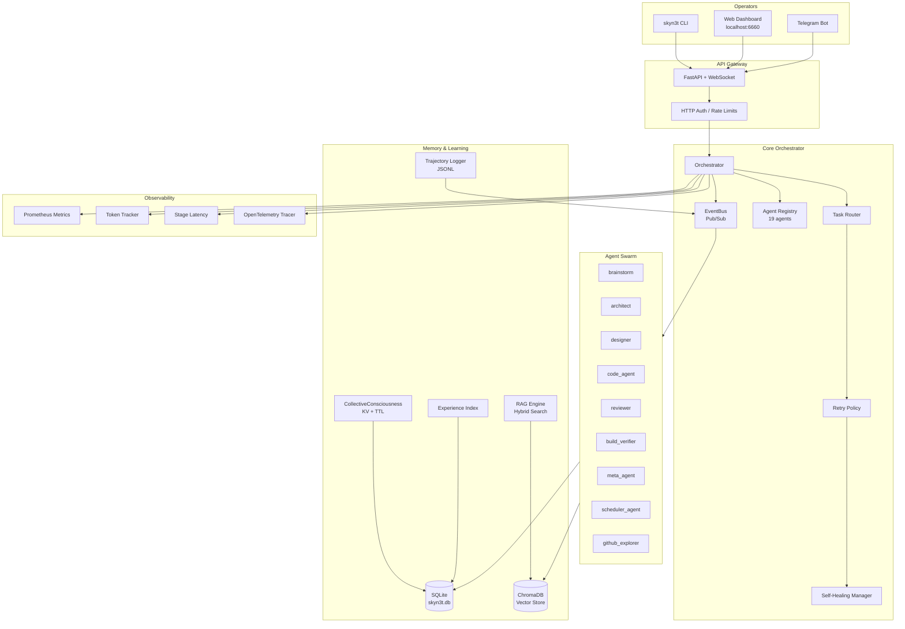
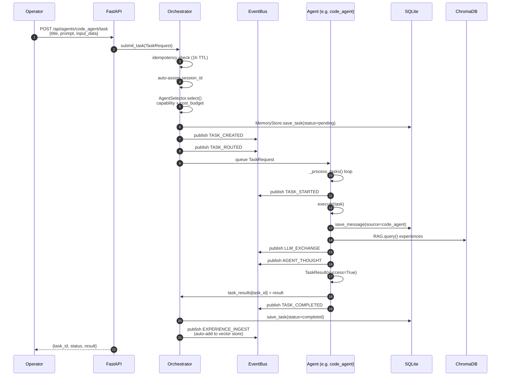
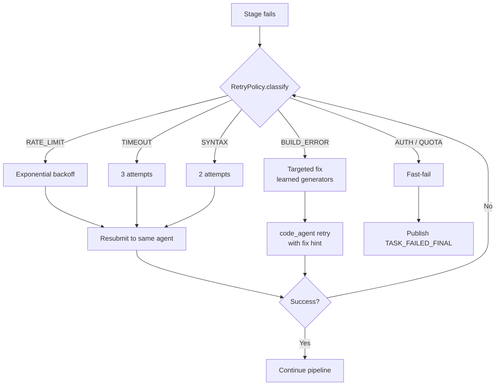
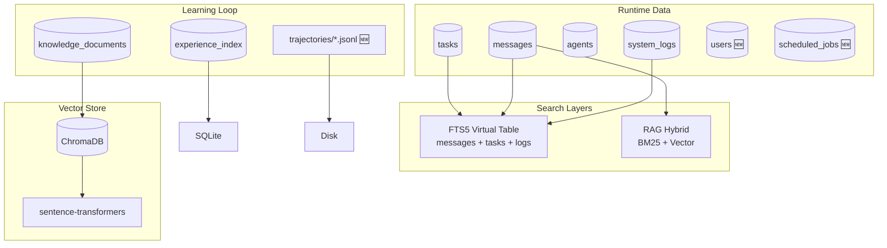
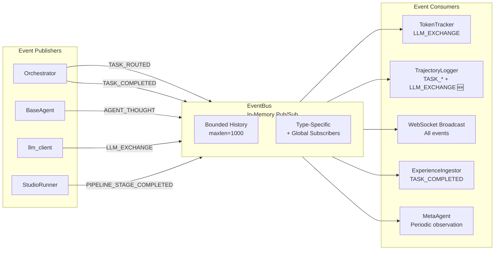
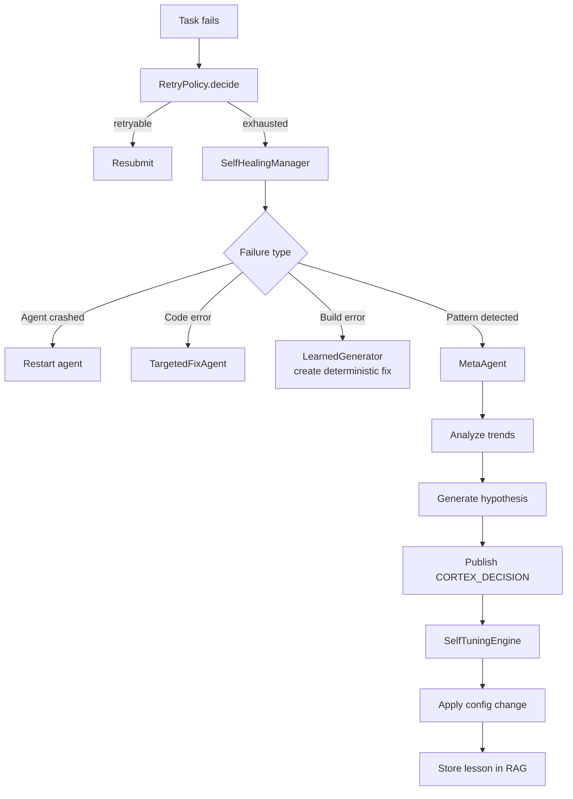
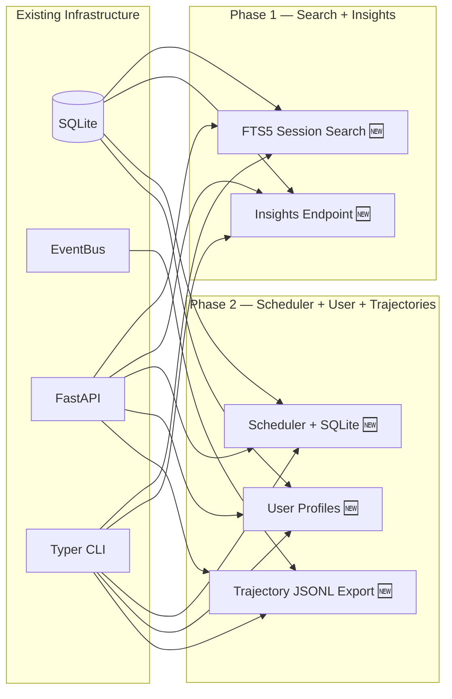

# SkyN3t Technical Architecture & Flow Diagrams

> Render this file in any Mermaid-compatible viewer (GitHub, GitLab, Notion, VS Code with Mermaid extension).

---

## 1. High-Level System Architecture

---

## 2. Task Execution Flow

---

## 3. Studio Pipeline Flow (Project Generation)

```mermaid
flowchart LR
    subgraph Input["Project Brief"]
        Brief["'Build a homelab dashboard'"]
    end

    subgraph Pipeline["Studio Pipeline"]
        direction LR
        Brainstorm["brainstorm<br/>🧠 Ideas + constraints"]
        Architect["architect<br/>🏗️ Stack + components"]
        Designer["designer<br/>🎨 UI/UX specs"]
        Code["code_agent<br/>💻 Scaffold + code"]
        PostCode["post-code checks"]
        Reviewer["reviewer<br/>🔍 Quality gate"]
        Consistency["consistency_reviewer<br/>⚖️ Cross-check"]
        Packaging["packaging_agent<br/>📦 Docker + README"]
        BuildVerif["build_verifier<br/>✅ npm/build test"]
    end

    subgraph Output["Deliverable"]
        Artifact["projects/homelab-dashboard-v53/<br/>├── scaffold/<br/>├── Dockerfile<br/>├── docker-compose.yml<br/>├── README.md<br/>└── review.md"]
    end

    Brief --> Brainstorm
    Brainstorm -->|ideas.json| Architect
    Architect -->|architecture.md| Designer
    Designer -->|design.md| Code
    Code -->|src/| PostCode
    PostCode -->|manifest.json| Reviewer
    Reviewer -->|verdict: go-with-fixes| Consistency
    Consistency -->|pass| Packaging
    Packaging -->|Docker + compose| BuildVerif
    BuildVerif -->|build_passed| Artifact
```

### Pipeline Retry Logic

---

## 4. Memory & Data Flow

---

## 5. Event Bus Architecture

---

## 6. Self-Healing & Meta-Agent Loop

---

## 7. New Features (Phase 1 & 2)

---

## 8. Technology Stack

| Layer | Technology |
|---|---|
| **Runtime** | Python 3.10+, asyncio |
| **Web** | FastAPI, WebSocket, uvicorn |
| **CLI** | Typer, Rich, httpx |
| **Database** | SQLite + aiosqlite + SQLAlchemy 2.0 |
| **Vector Search** | ChromaDB + sentence-transformers + BM25 |
| **FTS** | SQLite FTS5 (native) |
| **Observability** | Prometheus, OpenTelemetry-style tracing |
| **Testing** | pytest, AsyncMock |
| **Lint/Format** | ruff, black, mypy |
